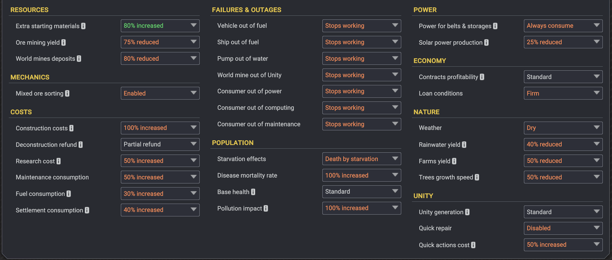

# Captain Of Industry

hi, my name is kenny! I'm a pretty serious/casual coi player. I really like the game, and it inspires a lot of thoughts while I'm playing -- so I [write them down](#thoughts-and-ideas) as I play.

my play style is a bit different than most; I play usually with [all of the difficulty settings maxed out](#neptune-difficulty), and I enjoy the challenge of trying to figure out a way to get to a point where I'm stable.

however, after a point -- the game gets really easy, so it's no longer a challenge -- and it's about that time I usually stop playing.

### Captain's Logs

(*save files coming as soon as I can figure out the commands to add them as git commits with the file modified timestamp*)

- [Ministry of Preparation](/clogs/Ministry%20of%20Preparation.md) + [TODO](/clogs/Ministry%20of%20Preparation%20TODO.md)
	- Armageddon map (insane starting location, [NEPTUNE DIFFICULTY](#neptune-difficulty))
	- going well. I feel like I've beat it 3 different ways now
- [Abandoned Expanse](/clogs/Abandoned%20Expanse.md)
	- You Shall Not Pass map (normal starting location, [NEPTUNE DIFFICULTY](#neptune-difficulty))
	- not much work done on it. after realizing the time investment necessary, I've focused my time on Ministry of Preparation instead

### Thoughts and Ideas

- [some bugs I've seen](/coi-bugs.md)
	- I decided to put them here because I was opening too many "issues" (hate that word) [on github](https://github.com/MaFi-Games/Captain-of-Industry-issues/issues/created_by/kennyb), and I felt like it was getting too much. there are just too many to make an issue for all of them -- so I mostly stopped making more "issues" for them.
	- some are old and some are unverified. some definitely still exist at the time of writing this (2024-07-13).
- [some features I'd like to have](/coi-features.md)
	- same as the bugs. I decided to keep them to myself, instead of pushing them out.
	- some of them are on the [coi suggestions/ideas page](https://ideas.captain-of-industry.com/) and some are not. one day I'll try and add them.
- [some thoughts I had on the game](/coi-thoughts.md) and some [unrelated ones too](/unrelated-thoughts.md)
- [some comments/improvements to the ui](/coi-ui.md)
- [pragtical coi](/pragtical-coi.md) -- a feature that I wrote about one day about how coi playthough can be thought of like a timeline, and as the timeline is optimised, it's like using a TAS for speedrunning, where the optimal flow for a streamer/speedrunner working on a segment can be practised and improved upon before the performance.

### NEPTUNE DIFFICULTY

this is a setting I use. it's admiral difficulty, PLUS
- **100% increased construction costs**
	- everything costs double from captain difficulty and 75% more than admiral.
	- this requires careful planning to ensure machines are close enough that belt costs aren't enormous 
- **50% increased maintenance consumption**
	- 25% more than admiral.
	- extra e1 requirement for maintenance makes cp2 production a lot more difficult in the earlygame, and a quick transition to steel for mechanical parts.
- **30% increased fuel consumption**
	- 15% more than admiral.
	- requires staying with blue trucks for a long while, and transporting materials with belts instead of trucks
- **40% increased settlement consumption**
	- 20% more than admiral.
	- more food consumption is a real problem, and requires a quick transition to bread once wheat is researched.
- **100% pollution impact**
	- 75% more than admiral.
	- this is the most difficult aspect, I think. the increased pollution requires immediate research of wastewater treatment, exhaust scrubbing, and hydrogen vehicles -- otherwise everyone is sick and dying all the time (clinic will prolly help, but it's so far down the research tree, it's easier just to *not pollute*)
- *80% increased starting resources*
	- without the extra resources I don't think it's possible, cause everything is so much more expensive (though, it also makes it a bit easier because the starting oil reserve is a bit bigger)
- **no dumping anything into the sea** -- *except rock*
	- I want to live on a clean island, so waste has to be dumped on the ground in earlygame, then cleaned up and burnt later. no building piers out of waste either because (IRL) waste decomposes and isn't a stable foundation to build on... true: loose rock isn't either, but we'll pretend it's held together with cement :)
